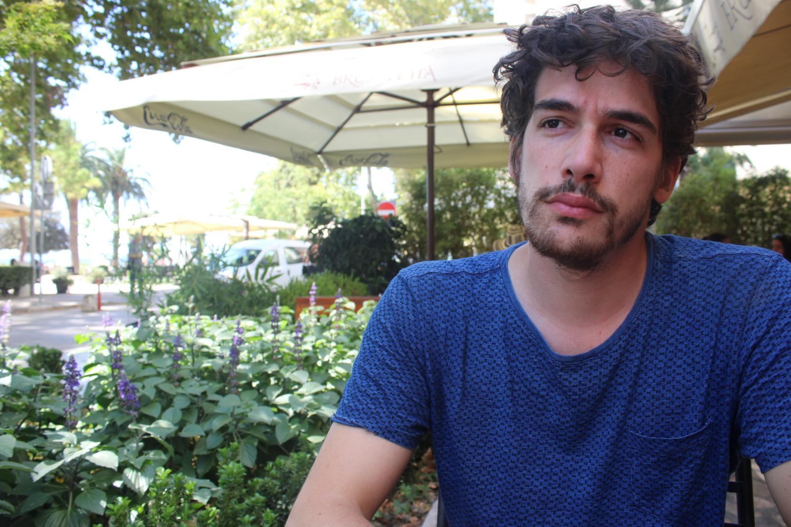

### Who am I?

My name is Miguel, and I am a **Machine Learning Engineer** working at Dressipi, a UK company that brings personalised 
ecommerce to fashion retailers. In my spare time I love programming, in particular creating ML systems and applications 
that I can share with the world. That's the reason why I decided to create **The Neural Maze**!

### How did I end up working as a MLE?

To be honest, I didn't study anything related to computer science, I am a Physicist, but life takes many turns and, 
after finishing Physics, I did a Master's degree related to Data Science and Big Data and started working in this field.
At first, I was a Data Scientist, but, gradually **my interests shifted towards building productive ML Systems, and that's
why I became a Machine Learning Engineer!** 😊

### Where do I live?

Right now I live in Almería, a beautiful region in southern Spain (I'm spanish, but from another region, much further 
north 🥶). One of the things I love about my job is the possibility to work remotely! I'm currently based in Almeria 
but who knows what the future holds?

---

Now it's your turn! Feel free to explore the [YouTube](https://www.youtube.com/channel/UCaixkLsW_TWWe_0yZNmvPaw) 
channel and / or read the articles that I will be publishing in this blog (sometimes they will be related with the YouTube content, sometimes they will not). 

Oh, and don't forget that you can also contact me on [LinkedIn](https://www.linkedin.com/in/moteropedrido/) or [Twitter](https://twitter.com/MTrofficus)!!!

Ciao! 👋

**(Before you leave the page, a picture of me meditating on the fugacity of life one summer afternoon)** 👇

