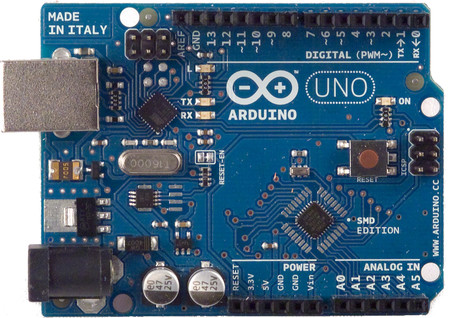
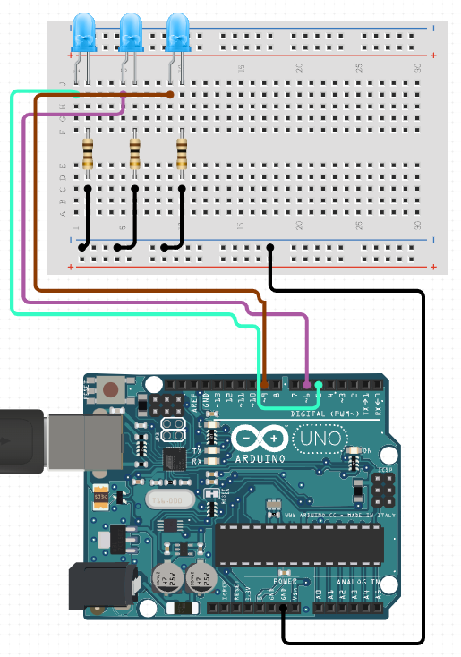
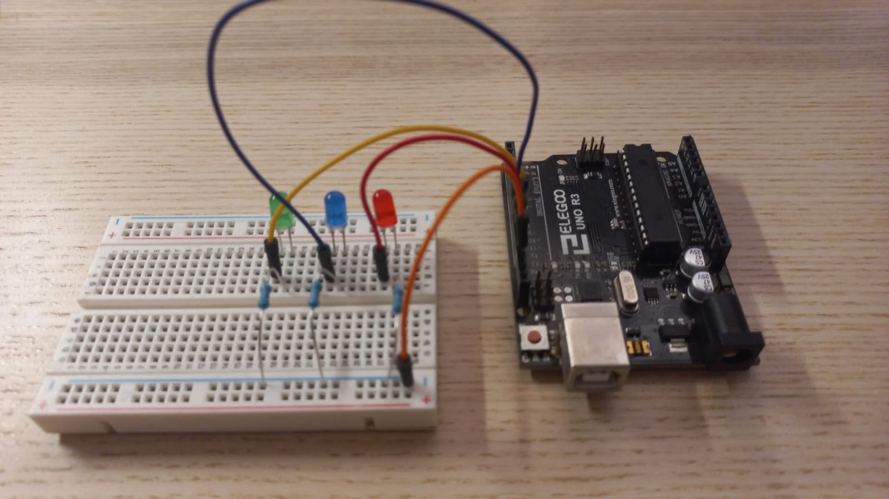

> If you prefer to go directly into the code, there’s a [GitHub repo available](https://github.com/neural-maze/crewai_llama3_arduino)!!

Even if I don't consider myself an expert (far from it!) in [Arduino](https://www.arduino.cc/) programming, I really
enjoy building electronic projects in my free time. That's the reason why, the other day, an idea came to my mind: 
**I know some things about AI and I know some things about Arduino so ... what if I make them work together?** 🤔

And given that in the recent weeks I've been working with [crewAI](https://www.crewai.com/), I didn't hesitate: **let's connect crewAI with Arduino**.
Does it sound exciting? What if I tell you that, in addition, I'll also be using [Ollama](https://ollama.com/) and Llama3 (local LLMs, oh yes 😎)

But, since it's possible that you've never heard of what an Arduino is. Let's calm down, and start with the basics.

Enjoy the ride! 🔥

> Warning! ⚠️⚠️⚠️ In this article I'm assuming you know crewAI, and by that I mean that you know what is a Task, 
an Agent or a Tool. If you don't know what I'm talking about, I strongly recommend you to check [this article](https://neural-maze.github.io/blog/posts/202404-crewai-linkedin-post/).


---

## What's an Arduino?

You can think of an Arduino as a small, programmable computer you can use to create your electronic projects, from 
simple circuits that make lights blink to full robots capable of moving. The possibilities are endless if you use
your imagination 💭

Simplifying (a lot 😅), when working with the Arduino platform, you have to differentiate between two "parts".

1️⃣  **The Board**

The Arduino board is the physical hardware that contains the microcontroller chip. This chip is the heart
of the Arduino and is responsible for executing the instructions you give it through your code.

<p align="center">
    
</p>


2️⃣  **Programming**

You write code (called sketches) using Arduino programming language (which is based on C / C++). These
sketches tell the Arduino what to do, such as turning on a light, reading the sensor data or controlling a servomotor.

For example, this is the sketch for turning on a LED for one second, then off for one second, repeatedly.

```c++
void setup() {
  pinMode(11, OUTPUT);
}

void loop() {
  digitalWrite(11, HIGH);   // turn the LED on (HIGH is the voltage level)
  delay(1000);                       // wait for a second
  digitalWrite(11, LOW);    // turn the LED off by making the voltage LOW
  delay(1000);                       // wait for a second
}
```

I won't get into the details of sketch programming, since it's out of the scope of this simple tutorial, but, if you are
interested in this fascinating world, I recommend you to step by the [Arduino official tutorials](https://www.arduino.cc/en/Tutorial/HomePage).
It contains a lot of examples and explanations (that's where I started my Arduino journey 😝)

---

## Three blinking LEDs

To validate the connection between crewAI and my Arduino, I chose a simple Arduino project: **making three LEDs blink
repeatedly**. You can check the circuit we are going to implement in the [circuit.io](https://www.circuito.io/) diagram below.


<p align="center">
    
</p>

And here, you have my "real world" implementation (much, much uglier than circuit.io, I know 🥲)

<p align="center">
    
</p>


The next "logical" step would be to program ourselves a sketch, for lighting on an off the LEDs. **But ... that's
exactly what we are going to automate!!** **Instead of programming the sketch ourselves, a crewAI agent will do it for us
and, instead of compiling and uploading the code to the Arduino ourselves, another crewAI agent will do it for us!!**


## Building the Crew

Let's focus on the following diagram, that displays the crewAI application we are about to build.

<p align="center">
    
</p>

As you can see, the crew is not complex. It consists of two agents: the **Sketch Programmer Agent**
and the **Arduino Uploader Agent**. The former agent will receive the description of the circuit 
and its intended behaviour, generating, in return, a sketch file (the extension of a sketch is `.ino` by the way).
The latter will take the generated sketch, compile it and upload the instructions into the Arduino.

So, if everything works as expected, we should end up with three beautiful blinking LEDs without writing one single
line of C 😍


### Sketch Programmer Agent

As you can see in the diagram above, the **Sketch Programmer Agent** is in charge of generating the code
(a sketch file with `.ino` extension) that brings to "life" our multi LED circuit. Since I wanted to
try local LLMs, I'm using [Ollama](https://ollama.com/), that lets you download and interact with 
local versions of well known LLMs (in my case, Llama 3).

I promised you at the beginning of this article that we were going to use Local LLMs, and I'm a man of my word.
In this case, I'll be using a local (quantised) version of Llama 3. How? **Simple, using the almighty Ollama.** 

> If you don't know Ollama, [Matthew Berman has a very good video about this](https://www.youtube.com/watch?v=rIRkxZSn-A8&t=33s&ab_channel=MatthewBerman).

To use Ollama inside crewAI, we just need to add the following lines before defining the agents.

```python
from langchain_openai import ChatOpenAI

llama3 = ChatOpenAI(
    model="llama3",
    base_url="http://localhost:11434/v1")
```

Notice that I'm using `llama3` as my model. If you want to use the same, make sure you've downloaded the model in Ollama!

```
ollama pull llama3
```

And remember that, if you want to try the model, you just need to run this

```
ollama run llama3
```

So now it's time to show you the agent.

```python
sketch_programmer_agent = Agent(
    role="Sketch Programmer",
    goal=dedent(
        """Write a Sketch script for Arduino that lights a red led in digital pin 11, 
        a blue led in digital pin 10 and a green led in digital pin 9 with a time
        between the three of 1 second."""),
    backstory=dedent(
        """
        You are an experienced Sketch programmer who really enjoys programming Arduinos
        """
    ),
    verbose=True,
    allow_delegation=False,
    llm=llama3,
)
```

The agent's goal has information about the circuit we implemented as well as the intended behaviour. In addition,
you can see the agent is using `llama3` as LLM.

But, where is the sketch file generated? No worries! We can control this from the Task assigned to this agent. Let
me show it to you.

```python
sketch_programming_task = Task(
    description=dedent(
        "Write a Sketch script that can be immediately uploaded to an Arduino. Just the Arduino code, nothing else."),
    expected_output=dedent("A plain Sketch script that can be copy and pasted directly into the Arduino CLI"),
    agent=sketch_programmer_agent,
    output_file="./tmp/tmp.ino",
)
```

Look at the `output_sile` attribute. That's exactly what we need;  the first agent will dump the generated
sketch code into the `./tmp/tmp.ino` file.


### Arduino Uploader Agent

Now that the previous agent has generated the sketch file, we'll need to compile it and upload
it into the Arduino. 

Ok, so now that the previous agent has generated the sketch file, the agent needs to compile it and upload it into the Arduino.
Sounds difficult, right? Well, ... far from it! **The solution is pretty easy: a custom tool.**

```python
import re
import subprocess

from crewai_tools import BaseTool


class CompileAndUploadToArduinoTool(BaseTool):
    name: str = "CompileAndUploadToArduinoTool"
    description: str = "Compiles and Uploads an Arduino Sketch script to an Arduino"
    ino_file_dir: str = "The directory that contains the ino file"
    board_fqbn: str = "The board type, e.g. 'arduino:avr:uno'"
    port: str = "The port where the Arduino is connected"

    def __init__(self, ino_file_dir: str, board_fqbn: str, port: str, **kwargs):
        super().__init__(**kwargs)
        self.ino_file_dir = ino_file_dir
        self.board_fqbn = board_fqbn
        self.port = port

    def _fix_ino_file(self):
        """
        This is a helper method for fixing the output .ino file when Llama3 adds some unintended text
        that invalidates the compilation.
        """
        with open(f"{self.ino_file_dir}/tmp.ino", "r") as f:
            content = f.read()

        pattern = r'```.*?\n(.*?)```'
        match = re.search(pattern, content, re.DOTALL).group(1).strip()

        with open(f"{self.ino_file_dir}/tmp.ino", "w") as f:
            f.write(match)

    def _run(self):
        self._fix_ino_file()

        try:
            subprocess.check_call([
                "arduino-cli", "compile", "--fqbn", self.board_fqbn, self.ino_file_dir
            ])
            subprocess.check_call([
                "arduino-cli", "upload", "--port", self.port, "--fqbn", self.board_fqbn, self.ino_file_dir
            ])
        except subprocess.CalledProcessError:
            return "Compilation failed"

        return "Code successfully uploaded to the board"
```

This tool expects three arguments:

- `ino_file_dir`: The directory containing the sketch. Remember we were using the `tmp` dir.
- `board_fqbn`: The board type. I'm using an Arduino UNO, so my board type is `arduino:avr:uno`, but it may be different in your case
- `port`: The port where the Arduino is connected. Mine is connected to port `/dev/cu.usbmodem1201`.

When the agent uses the tool (accessing the `_run` method), it will compile the code (`arduino-cli compile ...`) and then
upload it to the Arduino (`arduino-cli upload ...`). I defined this agent like this (in this case I used GPT4 since
it works much better for tool using):

```python
tool = CompileAndUploadToArduinoTool(
    ino_file_dir="./tmp",
    board_fqbn="arduino:avr:uno",
    port="/dev/cu.usbmodem1201"
)

arduino_uploader_agent = Agent(
    role="Arduino Uploader Agent",
    goal="Your goal is to compile and upload the received arduino script using a tool",
    backstory=dedent(
        """
        You are a hardware geek.
        """
    ),
    verbose=True,
    allow_delegation=False,
    tools=[tool]
)
```

The Task assigned to this agent is very straightforward.

```python
arduino_uploading_task = Task(
    description=dedent(
        "Compile and Upload the the Sketch script into the Arduino"),
    expected_output=dedent("Just compile the code and upload it into the Arduino"),
    agent=arduino_uploader_agent,
)
```

## Results

Nice! We have already defined all the pieces of our application so now it's time to put it all together by building the 
crew.

```python
from crewai import Crew
from dotenv import load_dotenv

from agents import sketch_programmer_agent, arduino_uploader_agent
from tasks import sketch_programming_task, arduino_uploading_task

load_dotenv()


crew = Crew(
            agents=[sketch_programmer_agent, arduino_uploader_agent],
            tasks=[sketch_programming_task, arduino_uploading_task],
        )

result = crew.kickoff()

print(result)
```

Curious about the results? Look at the video below!! 👀👀

<div style="display: flex; justify-content: center;">
    <video width="320" height="240" controls>
        <source src="img/arduino_llama3_crewai.mp4" type="video/mp4">
    </video>
</div>

--- 


