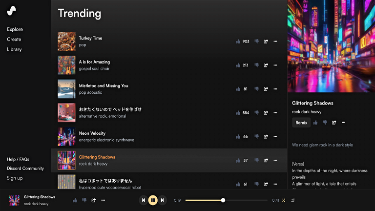
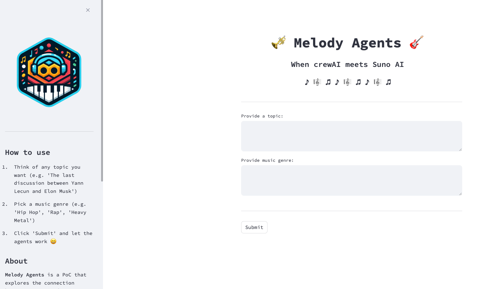
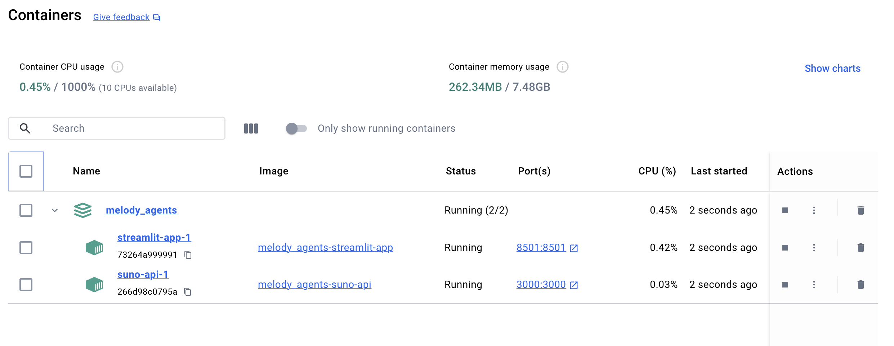

> If you prefer to go directly into the code, there’s a [GitHub repo available](https://github.com/neural-maze/melody_agents)!!

Imagine an application capable of combining [crewAI](https://www.crewai.com/) and
[Suno](https://suno.com/) ... 😮

Imagine an application where you only have to provide **a topic you are interested in** (*from the latest confrontation in X between Elon Musk and Yann Lecun, to the results of the elections in your country*), a **musical genre** and wait for a crew of agents to generate the songs for you. 🤯

Well, stop imagining, because today I'll show you how to build this app! 💪

---

## Suno AI ... and Suno API

If you've been paying attention to the Generative AI revolution (even if you haven't),
you've probably heard about [Suno AI](https://suno.com/), the application that 
creates songs from a simple phrase.

<p align="center">
    
</p>

But what if I don't want Suno to create the lyrics for my song? What if I want to provide
my own lyrics and just wait for Suno to generate the music? 🤔

Easy. There's also an option in Suno for that and, in fact, it's exactly what 
we'll need for our `Melody Agents` application. The thing is, our agents need
some way of interacting with Suno, and we're going to achieve this by using the (unofficial)
Suno API!!

In the repository accompanying this blogpost, you can see a [`Dockerfile`](https://github.com/neural-maze/melody_agents/blob/master/Dockerfile.suno) that creates a
container for the Suno API. It's just cloning [this amazing repo](https://github.com/gcui-art/suno-api) and simply starting the API.

```dockerfile
FROM node:lts-alpine
WORKDIR /app
RUN apk add --no-cache git
RUN git clone https://github.com/gcui-art/suno-api .
RUN npm install
RUN npm run build
COPY .env ./
EXPOSE 3000
CMD ["npm", "run", "start"]
```

One important detail is that if you want this API to work, you need to provide your Suno cookie as an environment variable. You can check the [README.md](https://github.com/neural-maze/melody_agents/blob/master/README.md) to set up all the necessary environment variables (just add the variables to an `.env` file and follow the Suno API documentation step by step).

The Suno API exposes a lot of useful methods, but we're only going to use one of them, the
`/api/custom_generate` method, which generates music from the given lyrics. Later, you'll
see how to make requests to this method by means of a custom tool.

## Building a Crew

So, let's recap for a second. For now, we have a way to access Suno programmatically by making requests to an API endpoint. This endpoint, given some lyrics, will return a couple of songs generated by Suno AI. 

Now, we also need to create some agents, which will be in charge of gathering all the relevant information about any topic you
want, to elaborate award winning lyrics (😉) and to interact with the API via a Custom Tool.

The Crew is organised as follows 👇

<p align="center">
    
</p>

As you can see, we have three agents, each with its own assigned task, and two tools. 

One of these tools ([SerperTool](https://docs.crewai.com/tools/SerperDevTool/)) will allow the first agent to perform web searches, necessary to obtain information about the topic of our interest. The other tool is the most important one, as it allows us to connect to Suno!

But, before describing this custom tool in more detail, let's take a look at the agents ... 🤖

### Agents

As I said before, the crew is composed of three agents.

#### Web Researcher Agent

Nothing too complex about this one to be honest. It just looks for web content about the specified 
topic by using the `SerperDevTool`.

```python
def web_researcher_agent(self):
    return Agent(
        role="Web Researcher",
        goal="Conducts a web search on a topic, generating a detailed report on the matter",
        tools = [self.search_tool, self.scrape_website_tool],
        backstory=dedent(
            "An expert in conducting web researchs about any topic"
        ),
        verbose=True,
        allow_delegation=False,
        callbacks=[CustomStreamlitCallbackHandler(color="green")],
        llm=self.llm,
        max_rpm=5000
    )
```

> Are you wondering about the `callbaks` param and the [`CustomStreamlitCallbackHandler`](https://github.com/neural-maze/melody_agents/blob/master/callback_handler.py)? This is just a callback
that connects crewAI logs with Streamlit, so that, when running the application, we have traces of what's
happening under the hood.

#### Lyrics Creator Agent

This agent takes as input the research carried out by the previous agent and elaborates
from it high quality lyrics. It doesn't use any tools (there was no need). 

```python    
def lyrics_creator_agent(self):
    return Agent(
        role="Lyrics Creator",
        goal=dedent("""Create the most amazing lyrics about a topic
                    adapting the writing style to the music genre."""),
        backstory="A creative lyricist who excels at creating high quality lyrics",
        verbose=True,
        allow_delegation=False,
        callbacks=[CustomStreamlitCallbackHandler(color="green")],
        llm=self.llm
    )
```

#### Song Generator Agent

The last agent of the crew; it takes the generated lyrics and sends them to Suno through the
Suno API Custom Tool (more on this tool later, I promise 🙏)

```python
def song_generator_agent(self):
    return Agent(
        role="Song Generator",
        goal=dedent("""Create a song using the Suno AI Tool. You must 
                    take the lyrics generated by the previous agent and
                    pass this lyrics to the Tool"""
        ),
        backstory="You are a song creator that loves creating songs using Suno AI",
        tools=[self.suno_tool],
        verbose=True,
        allow_delegation=False,
        callbacks=[CustomStreamlitCallbackHandler(color="green")],
        llm=self.llm
    )
```

### Suno API Custom Tool

So, we've been talking about the Suno Custom Tool before, now it's time to really understand what this tools
consists of! Let me show you the code first:

```python
import time
import json
import requests
from typing import Type
from pydantic.v1 import BaseModel, Field
from crewai_tools import BaseTool


class SunoToolSchema(BaseModel):
    """Input for SunoTool"""
    url: str = Field(..., description="URL for the Suno API. This field is mandatory")
    genre: str = Field(..., description="The song genre. E.g. Hip Hop, Rap, Pop, etc.")
    

class SunoTool(BaseTool):
    name: str = "Generate a song from the lyrics"
    description: str = "A tool that can be used to generate a song from the provided lyrics."
    args_schema: Type[BaseModel] = SunoToolSchema
    url: str = ""
    genre: str = ""
    
    def __init__(self, url: str, genre: str, **kwargs):
        super().__init__(**kwargs)
        self.url = f"{url}/api/custom_generate"
        self.genre = genre
        
    def _run(
        self,
        lyrics: str,
        **kwargs
    ):
        payload = {
            "prompt": lyrics,
            "tags": self.genre,
            "title": "Melody Agents Song",
            "make_instrumental": False,
            "wait_audio": False
        }
        try:
            response = requests.post(self.url, json=payload, headers={'Content-Type': 'application/json'})
            _ = response.json()
        except Exception as e:
            raise ValueError(e)
        
        return "Your songs are being generated ... 🤖"

```

If you take a look at the `_run` method (the method called by the agent), you'll see the logic is
actually very simple. 

The tool is making a POST request to the Suno API (remember that we are deploying the API in a container!),
in particular, to the `/api/custom_generate` method. The request payload contains all the relevant information, such as the `prompt` (that's the field containing the generated lyrics), `tags` (this
field contains the musical genre), `title`, and so on.

If the POST request returns a `200`, it means Suno will start generating **two candidate songs** from
the provided information.

### The Crew

I know, I know, you might be wondering: *But wait ... where are the tasks?*

The tasks for this application were pretty straightforward, so I thought it wasn't even necessary to discuss
them here. Of course, you have [the implementation](https://github.com/neural-maze/melody_agents/blob/master/tasks.py) in the repository if you want to take a look 😊

As for the crew, I decided to create the following class, which creates a `Crew` instance under the hood
and kicks it off!

And ... yes! I'm using [Groq](https://groq.com/) for this application! The best part is that both the Suno API and Llama3-70B (using Groq) are completely free! **Isn't that AMAZING?**


```python
class MelodyCrew:
    
    # Change the URL if you are using another port
    URL = "http://suno-api:3000"
    LLM = ChatGroq(api_key=os.environ.get("GROQ_API_KEY"), model="llama3-70b-8192")

    
    def __init__(self, topic: str, genre: str):
        self.topic = topic
        self.genre = genre
        
    def run(self):
        agents = MelodyAgents(url=self.URL, genre=self.genre, llm=self.LLM)
        tasks = MelodyTasks()
        
        web_researcher_agent = agents.web_researcher_agent()
        lyrics_creator_agent = agents.lyrics_creator_agent()
        song_generator_agent = agents.song_generator_agent()
        
        web_research_task = tasks.web_research_task(
            agent=web_researcher_agent, 
            topic=self.topic
        )
        lyrics_creation_task = tasks.lyrics_creation_task(
            agent=lyrics_creator_agent, 
            topic=self.topic, 
            genre=self.genre
        )
        song_generation_task = tasks.song_generation_task(
            agent=song_generator_agent
        )
        
        crew = Crew(
            agents=[
                web_researcher_agent,
                lyrics_creator_agent,
                song_generator_agent
            ],
            tasks=[
                web_research_task,
                lyrics_creation_task,
                song_generation_task
            ],
        )
                
        return crew.kickoff()
```

## Streamlit as Frontend

Ok guys, we are close to the end, I promise 😁 

But the thing is that I wasn't satisfied enough with the application, so I wanted to add a cool
frontend to it. Not just run a python file from the terminal, but an easy to use interface.

So, with less than [100 lines of Streamlit](https://github.com/neural-maze/melody_agents/blob/master/app.py), I created this interface:

<p align="center">
    
</p>

The user provides a topic and a music genre and ... waits for the agents to do the hard work 😎

## Docker Composing Everything

To make the application even better we will also containerise the streamlit application (and
all the crewAI code of course), making it available on port `8501` of your localhost.

```dockerfile
# Use a specific version of python:3.11-slim as the base image. 
# I'm using python:3.11 for compatibility with crewAI
FROM python:3.11-slim

# Set the working directory
WORKDIR /app

# Install dependencies and clean up apt cache in one layer to reduce image size
RUN apt-get update && apt-get install -y \
    build-essential \
    curl \
    software-properties-common \
    git \
    && rm -rf /var/lib/apt/lists/*

# Copy the source dir
COPY . .

# Install Python dependencies
RUN pip3 install --no-cache-dir -r requirements.txt

# Expose the port that Streamlit will run on
EXPOSE 8501

# Add a health check to ensure the container is running as expected
HEALTHCHECK CMD curl --fail http://localhost:8501/_stcore/health

# Set the entrypoint to run the Streamlit application
ENTRYPOINT ["streamlit", "run", "app.py", "--server.port=8501", "--server.address=0.0.0.0"]
```

Finally, let's also use [Docker Compose](https://docs.docker.com/compose/) for building a proper multi-container application. The `docker-compose.yml` contains the application specifications,
as you can see below.

```yml
version: '3'

services:
  suno-api:
    build:
      context: .
      dockerfile: Dockerfile.suno
    ports:
      - "3000:3000"
  streamlit-app:
    build:
      context: .
      dockerfile: Dockerfile
    ports:
      - "8501:8501"
    depends_on: [suno-api]
```

The `docker-compose.yml` defines two services, one for the Suno API (`suno-api`), which is exposed
on port `3000` and the other the Streamlit Application (`streamlit-app`), exposed on port `8501`.

Now, let's build and start the multi-container application! 💪

```sh
docker compose build & docker compose up
```

If you go to your [Docker Desktop](https://www.docker.com/products/docker-desktop/) (if you don't use 
Docker Desktop, you're probably out of your mind ... just kidding 🤣) you should see something like this:


<p align="center">
    
</p>


## Elon Musk vs Yann Lecun (Rap Version)

Let's get into the Streamlit Application (remember, `http://localhost:8501/`) and 
test our new creation!

What if ... we ask the agents to create a Rap song about the recent X discussions
between Elon Musk and Yann Lecun? (in case you missed it, [this Medium post](https://medium.com/@jodhernandezbemj/the-elon-musk-vs-yann-lecun-debate-a-clash-of-titans-in-tech-and-science-b5979e7b1594) provides a nice summary)

<div style="display: flex; justify-content: center;">
    <video width="700" height="500" controls>
        <source src="img/melody_agents_example.mov" type="video/mp4">
    </video>
</div>

---

Hope you enjoyed this article!! Give a star to the repo if you found it useful and ... I'll
see you around!! 🫵


